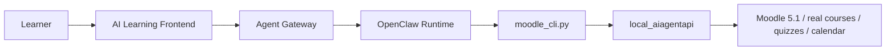

# OpenClaw Frontend Architecture for Moodle AI Learning

## Goal

Build a user-facing frontend where learners interact primarily with an AI tutor instead of navigating Moodle directly.

The AI agent uses OpenClaw as the interaction runtime and calls the existing Moodle CLI and `local_aiagentapi` stack to read course state, guide learning, and write learning actions back into Moodle.

## Core direction

Keep Moodle as the system of record.

Do not move business logic into the frontend.

Use this layering:

1. Frontend app
2. Agent gateway / orchestration layer
3. OpenClaw agent runtime
4. `scripts/moodle_cli.py`
5. `public/local/aiagentapi`
6. Moodle database + Moodle modules

## Recommended architecture

## Why this is the right split

- Moodle remains the canonical data source for courses, quizzes, assignments, calendar, and progress.
- `local_aiagentapi` remains the canonical server-side contract.
- `moodle_cli.py` remains the thin agent-facing wrapper.
- OpenClaw handles reasoning, turn management, and tool selection.
- The frontend only handles user interaction, presentation, and session UX.

This matches the rules we already established in this repo:

- server-side logic stays in `local_aiagentapi`
- CLI stays thin
- skill files describe capability use, not business rules

## Product experience to target

The learner should feel like they are using an AI tutor, not a Moodle dashboard.

The frontend home screen should answer four questions immediately:

1. What should I learn next?
2. What is due soon?
3. What am I weak at?
4. Do I want explanation mode or quiz mode right now?

## Frontend modules

### 1. Chat workspace

Primary interface.

Responsibilities:

- natural language chat with the AI tutor
- show agent reasoning summary, not raw chain-of-thought
- render structured tool results as cards
- let the user switch between:
  - explain mode
  - guided practice mode
  - quiz mode
  - plan mode

### 2. Learning plan panel

Responsibilities:

- show current 7-day / 14-day study plan
- allow accept / adjust / regenerate
- show plan items already synced to Moodle calendar

Backed by:

- `calendar list`
- `calendar upsert-plan`
- `activities due`
- `progress course`

### 3. Course navigator

Responsibilities:

- show enrolled courses
- show current course outline
- highlight recommended next activity or quiz

Backed by:

- `courses list`
- `courses outline`
- `activities list`
- `resources list`

### 4. Quiz workspace

Responsibilities:

- render AI-selected quiz or question practice
- show one question at a time
- let the AI explain before answer or after answer
- persist attempts through Moodle, not browser-local state

Backed by:

- `quiz list`
- `quiz start`
- `quiz attempt-data`
- `quiz answer`
- `quiz submit-attempt`
- `questions render-html`

### 5. Progress dashboard

Responsibilities:

- weak topics
- due tasks
- recent quiz attempts
- grade trend
- completion trend

Backed by:

- `grades overview`
- `quiz attempts`
- `assignments status`
- `progress course`
- `notifications list`

## Agent responsibilities

OpenClaw should not be a raw chatbot bolted onto Moodle.

It should act as a task-oriented tutor with explicit modes.

### Recommended agent modes

1. `coach`
- explain concepts
- recommend next actions
- summarize weak areas

2. `planner`
- build and revise study plans
- sync plans to calendar

3. `quiz-guide`
- choose suitable quizzes
- walk the learner through attempts
- decide when to explain vs test

4. `reviewer`
- summarize completed attempts
- identify mistakes and patterns
- assign next review set

## Required gateway layer

Do not let the browser call the Moodle CLI directly.

Add a small backend gateway between frontend and OpenClaw.

Responsibilities:

- session auth for your own frontend
- user-to-Moodle-token mapping
- rate limiting
- tool allowlist per user/session
- audit logs for agent actions
- stable frontend-friendly response shapes

Recommended shape:

- frontend calls your app backend
- backend sends structured task requests to OpenClaw
- OpenClaw is allowed to invoke only approved Moodle CLI commands

## Suggested backend contracts

### Frontend -> agent gateway

Use app-native JSON APIs, for example:

- `POST /api/chat`
- `POST /api/plan/generate`
- `POST /api/plan/apply`
- `GET /api/dashboard`
- `POST /api/quiz/start`
- `POST /api/quiz/answer`
- `POST /api/quiz/submit`

### Agent gateway -> OpenClaw

The gateway should provide:

- current app user id
- mapped Moodle identity
- selected course id
- current tutor mode
- allowed CLI commands
- short session memory summary

### OpenClaw -> Moodle CLI

The allowed tool surface should be small at first.

Start with:

- `context get`
- `courses list`
- `courses outline`
- `activities due`
- `progress course`
- `calendar list`
- `calendar upsert-plan`
- `quiz list`
- `quiz start`
- `quiz attempt-data`
- `quiz answer`
- `quiz submit-attempt`
- `grades overview`

## First release scope

Do not try to replicate all of Moodle on day one.

### v1 scope

1. sign in to the frontend
2. show my courses
3. choose one course
4. AI generates a 7-day study plan
5. plan syncs to Moodle calendar
6. AI launches one quiz attempt
7. learner answers inside the frontend
8. AI explains mistakes and recommends next step

This is already enough to prove the product.

## Session model

The agent needs a session model above Moodle.

Store these per frontend session:

- frontend user id
- mapped Moodle user id
- current course id
- current course name
- tutor mode
- current attempt id if in quiz flow
- current plan key if in planning flow
- short memory summary

Do not rely on long unbounded chat history.

Use compact session state plus Moodle as the durable system of record.

## Security model

### Do

- use per-user Moodle tokens
- keep tokens server-side only
- let OpenClaw call only allowlisted commands
- require explicit confirmation for write actions if user-visible impact is high
- log every write action with user id, course id, and tool invocation

### Do not

- expose Moodle tokens to the browser
- let the frontend call `webservice/rest/server.php` directly
- let the agent run arbitrary shell commands
- let the agent call unrestricted CLI commands

## UX principle

The frontend should translate Moodle structure into AI-native tasks.

Examples:

- not `Here are 71 quizzes`
- but `You are weak in biology cell transport. Do you want a 10-minute explanation or a 5-question test?`

- not `Open course section 4`
- but `Today we should finish Information Processing chapters 1 to 2 before your mock paper.`

## How OpenClaw should use the CLI

Preferred interaction pattern:

1. inspect context
2. fetch compact course state
3. decide next teaching action
4. call one CLI command at a time
5. summarize the result for the learner
6. write back only when needed

This means:

- avoid large blind reads on every turn
- avoid writing plans repeatedly without diffing
- prefer `calendar upsert-plan` over repeated raw publish calls
- prefer attempt lifecycle calls over scraping Moodle pages

## Suggested implementation order

### Phase 1

Build the frontend shell and gateway.

Deliver:

- chat screen
- dashboard screen
- course picker
- backend route that calls OpenClaw

### Phase 2

Connect planning workflow.

Deliver:

- generate plan from real course
- preview plan
- write plan to Moodle calendar
- read plan back

### Phase 3

Connect guided quiz workflow.

Deliver:

- choose quiz
- start attempt
- render question card
- answer supported question types
- submit attempt
- summarize result

### Phase 4

Add adaptive tutoring.

Deliver:

- weakness detection
- spaced review suggestions
- retry strategy by topic
- course-wide progress summaries

## Recommended near-term repo changes

1. add an app backend folder for the frontend gateway
2. add a stable internal API contract for the frontend
3. add a command allowlist specifically for frontend agent sessions
4. add one session-state store for current course and attempt
5. add one page that proves the full loop:
   - choose course
   - generate plan
   - write plan
   - start quiz
   - answer one question

## Immediate next build target

The best next concrete target is:

`AI tutor dashboard for one real course`

It should support:

- selecting `course 92`
- showing the current 7-day plan
- syncing plan to calendar
- launching `quiz 431`
- answering one multiple-choice question through the AI flow

This uses real data and aligns with the CLI paths already proven in this repo.
